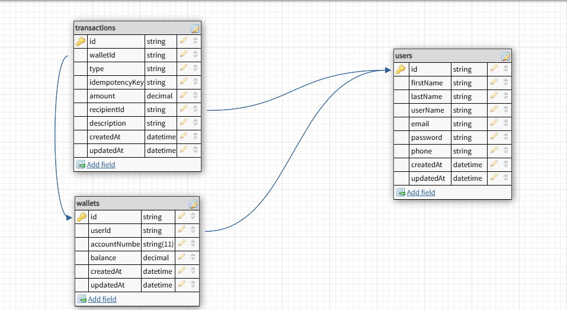

# 💸 Lendsqr Wallet Service

A secure and scalable digital wallet backend built with **Node.js**, **TypeScript**, and **MySQL**, enabling users to create accounts, fund wallets, withdraw, and transfer funds seamlessly.

---

## 📘 Table of Contents

- [Project Overview](#project-overview)
- [Features](#features)
- [Tech Stack](#tech-stack)
- [Database Design](#database-design)
  - [ER Diagram](#er-diagram)
- [API Endpoints](#api-endpoints)
- [Installation & Setup](#installation--setup)
- [Testing](#testing)
- [Bash Scripts](#bash-scripts)
- [Folder Structure](#folder-structure)
- [Security](#security)
- [License](#license)


---

## ✅ Project Overview

This project serves as the core wallet infrastructure for a fintech system. Users can perform common wallet operations including registration, authentication, balance management, and peer-to-peer fund transfers.

---

## ✨ Features

- JWT-based authentication
- Idempotent wallet funding
- Withdraw funds with balance validation
- Transfer funds to other users via account number
- Unit-tested service layer
- Bash scripts for manual testing

---

## 🛠 Tech Stack

| Layer        | Technology            |
|--------------|------------------------|
| Language     | TypeScript             |
| Runtime      | Node.js                |
| Framework    | Express.js             |
| Database     | MySQL                  |
| ORM/Query    | Knex.js                |
| Auth         | JWT (jsonwebtoken)     |
| Validation   | Custom utils           |
| Testing      | Jest                   |
| Scripting    | Bash + Curl            |
| Env Config   | dotenv                 |

---

## 🧩 Database Design


---

## 📡 API Endpoints

| Method | Endpoint              | Description                       |
|--------|-----------------------|-----------------------------------|
| POST   | `/api/account/register`  | Register new user                 |
| POST   | `/api/account/login`     | Login and receive JWT             |
| POST   | `/api/wallet/fund`    | Fund user wallet                  |
| POST   | `/api/wallet/withdraw`| Withdraw from wallet              |
| POST   | `/api/wallet/transfer`| Transfer to another account       |

> ℹ️ All wallet routes are protected and require a **Bearer JWT token**.

---

## ⚙️ Installation & Setup

```bash
# 1. Clone the repo
git clone https://github.com/yourusername/lendsqr-wallet.git

# 2. Navigate into project
cd lendsqr-wallet

# 3. Install dependencies
npm install

# 4. Configure your .env file
cp .env.example .env
# Fill in DB credentials, JWT secret, etc.

# 5. Run migrations
npx knex migrate:latest

# 6. Start the app
npm run dev
```

---

## 🧪 Testing

Run all unit tests:

```bash
npm test
```

---

## 🧾 Bash Scripts

For manual testing using bash:

```bash
chmod +x scripts/create-user.sh
```

---
## 🗂️ Folder Structure
```bash
src/
├── app.ts
├── server.ts
├── controllers/
├── services/
├── models/
├── routes/
├── db/
├── middlewares/
├── utils/
├── tests/
└── scripts/
```
---
## 🔐 Security

- Passwords are securely hashed using **bcrypt**
- JWT authentication is required for all protected routes
- Idempotency key support for wallet funding
- Input validation is implemented at the controller level


